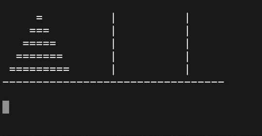

# Tower of Hanoi Solver 🎯

This Python script visually solves the Tower of Hanoi puzzle using recursion and terminal animations.

## Features
- Animated console visualization
- Customizable number of discs
- Move counter and timing
- Adjustable animation speed

## How to Run
1. Install Python 3
2. Clone this repo: git clone https://github.com/fcavaletto/hanoi-visualizer.git
3. Run: python hanoi.py 5 5

